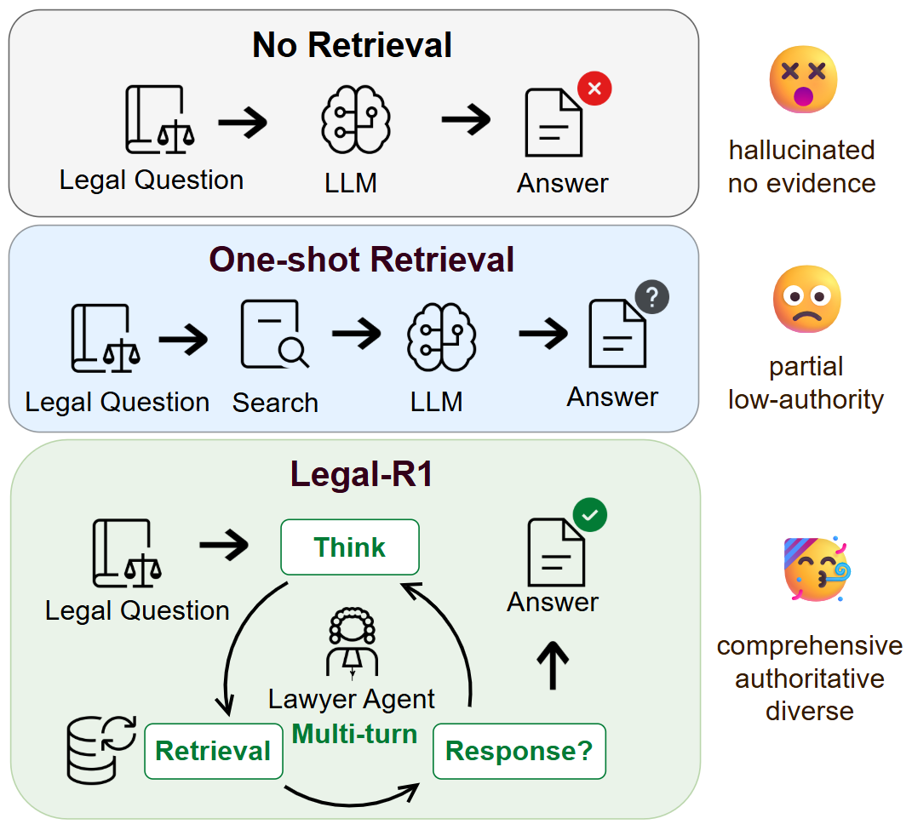
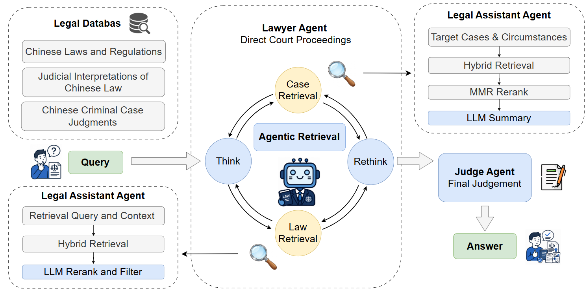
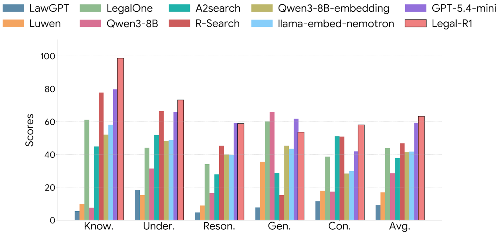
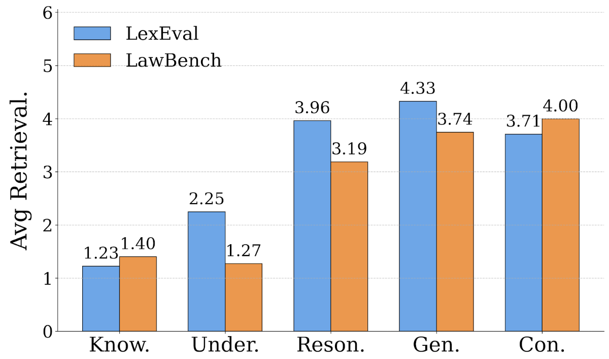

# ⚖️ Legal-R1: Agentic Retrieval for Evidence-Based Legal Reasoning

## 📖 Introduction
**Legal-R1** is an agentic retrieval framework developed for evidence-based legal question answering. Traditional Retrieval-Augmented Generation (RAG) pipelines often rely on single-turn semantic matching, which falls short because legal systems demand verification based on authority, temporal validity, and outcome diversity. 

<p align="center">
  <br>
  <em>Figure 1: Motivation of Legal-R1. Legal-R1 replaces one-turn semantic matching with multi-turn evidence seeking over norms and cases.</em>
</p>

Legal-R1 reformulates legal question answering as an explicit problem of **evidence construction** rather than a simple database lookup. It decomposes the process into a multi-agent workflow where a post-trained **Lawyer Agent** serves as the central manager to autonomously plan multi-turn evidence seeking. It collaborates with a **Legal Assistant Agent** that conducts authority-aware and sentencing diversity-aware retrieval across heterogeneous normative legal and precedent corpora, and a **Judge Agent** that synthesizes the entire retrieval trajectory to formulate the final grounded judgment.

### 🔄 Multi-Agent Workflow Architecture
The workflow makes evidence collection explicit and encourages answers to be grounded in comprehensive, authoritative, and diverse legal evidence:

<p align="center">
  <br>
  <em>Figure 2: Overview of the proposed agentic legal retrieval workflow.</em>
</p>

---

## ✨ Key Features
* 🧠 **Explicit Multi-Turn Planning**: Instead of one-shot lookups, the Lawyer Agent determines whether to retrieve, which source to query, what evidence to seek, and when the collected evidence is fully sufficient to answer.
* ⚖️ **Authority & Diversity-Aware Reranking**: For judicial precedents, the system adapts Maximal Marginal Relevance (MMR) using an Authority Hierarchy Score and a uniquely developed Punishment Severity Index (PSI) to balance legal hierarchy and eliminate outcome redundancy.
* 🎯 **Evidence-Masked SFT & Trajectory-Aware RL**: Post-trained using masked supervised fine-tuning to focus on tool-use protocols without memorizing texts, followed by Group Relative Policy Optimization (GRPO) to optimize strategic reasoning policies.
* 🧹 **Automated Data Purification**: Built upon a high-quality dataset of 18,940 structured QA instances processed through rigorous task-driven applicability gating and fingerprint-based contamination filtering to ensure empirical data purity.

---

## 📊 Main Performance Comparison
The framework was comprehensively evaluated on two widely recognized Chinese legal benchmarks: LexEval and LawBench. Below is the comparative analysis verified by an independent LLM-as-a-judge runner:

| Model | Retrieval | Scale | LawBench (LLM Judge) | LexEval (LLM Judge) | Overall Avg. |
| :--- | :---: | :---: | :---: | :---: | :---: |
| **Legal-R1 (Ours)** | **✓** | **8B** | **57.36%** | **63.28%** | **60.28%** |
| DeepSeek-V4-Flash | X | 284B | 62.40% | 72.90% | 66.47% |
| GPT-5.4-Mini | X | - | 62.83% | 59.32% | 56.87% |
| R-Search | ✓ | 7B | 43.01% | 46.85% | 45.59% |
| Qwen3-8B-Embedding | ✓ | 8B | 32.92% | 41.40% | 38.34% |
| LegalOne | X | 8B | 41.02% | 43.79% | 35.84% |
| Qwen3-8B (Vanilla) | X | 8B | 40.20% | 28.47% | 27.85% |

**Figure 3** breaks down the performance across various legal cognitive dimensions to evaluate fine-grained capabilities. The results demonstrate that Legal-R1 consistently outperforms alternative legal-specific and RAG baselines, proving that active multi-turn evidence planning is far superior to static parametric memories or one-shot retrievers.

<p align="center">
  <br>
  <em>Figure 3: Model Performance on Lexeval's Five Categories.</em>
</p>

### 🏆 Core Findings
* 🚀 **Unmatched Parameter Efficiency**: At a lightweight 8B parameter scale, Legal-R1 yields a top-tier average score of 60.28%. It significantly defeats the strong competitive RAG model, R-Search, by 14.69 points and outpaces the massive proprietary model GPT-5.4-Mini by 3.41 points.
* ⚙️ **Adaptive Efficiency (Pareto-Optimal Cost)**: The agent dynamically scales its computational overhead depending on the complexity of the inquiry. For simpler requests (Knowledge Retrieval or Understanding), the system limits tool utilization to an average of 1.2–1.7 turns. For advanced legal consultation, reasoning, or text generation tasks, it intelligently scales up to 3.1–4.3 turns to coordinate multi-hop information synthesis.
* 🧩 **Orthogonal Optimization Benefits**: Ablation studies indicate that while standard legal post-training injections provide major domain alignment (+18.03 points), the final synergistic peak is uniquely unlocked by integrating active multi-stage agent planning combined with GRPO multi-tier trajectory rewards.

**Figure 4** evaluates the system's operational efficiency and dynamic tool-use decision policy. The trend demonstrates that Legal-R1 successfully achieves a Pareto-optimal balance between performance and computational cost by adaptively scaling its retrieval turns based on task complexity.

<p align="center">
  <br>
  <em>Figure 4: Average Retrieval Turn for Different Complexity Tasks on Lawbench and Lexeval Benchmark.</em>
</p>

---

## 🛠️ Installation

### 📋 Prerequisites
* [Anaconda](https://www.anaconda.com/) or [Miniconda](https://docs.conda.io/en/latest/miniconda.html)
* `tmux` (Please install this manually via your system's package manager, e.g., `sudo apt install tmux`)

### ⚡ One-Click Installation
In the **root directory** of the project, open your terminal and run the following command:

```bash
bash install_envs.sh
```

## 🚀 Quick start
### 🏋️‍♂️ SFT(Supervised Fine-Tuning)
Fine-tune the model on an 4-GPU setup:
```bash
conda activate SFT
accelerate launch --config_file ./configs/deepspeed_zero3.yaml --machine_rank 0 --deepspeed_multinode_launcher standard SFT.py --model_path "/path/to/your/model" --data_path ./data/train_data/SFT/SFT.json --output_dir "/path/to/your/model/SFT_ckp" --log_dir "/path/to/your/log_dir" --experiment_name Legal_R1_SFT --train_bsz_per_gpu 2 --max_seq_len 10000 --n_epochs 3
```

### 🎓 RL(Reinforcement Learning)
The RL configuration provided below is optimized for a 4x H20 (141GB VRAM) setup. 
Please adjust the hyperparameters accordingly to accommodate your specific computational resources.
```bash
conda activate Legal_R1
bash RL.sh
```

### 📝 inference on dataset
💡 **Pipeline Overview:** This pipeline handles batch generation of responses for your datasets. You are free to define a custom dataset (matching the required format), specify the model to be used, and configure the output paths. Please adjust these settings directly in the **Configuration Area** of the Python script.
```bash
conda activate Legal_R1
python infer_pipeline.py
```